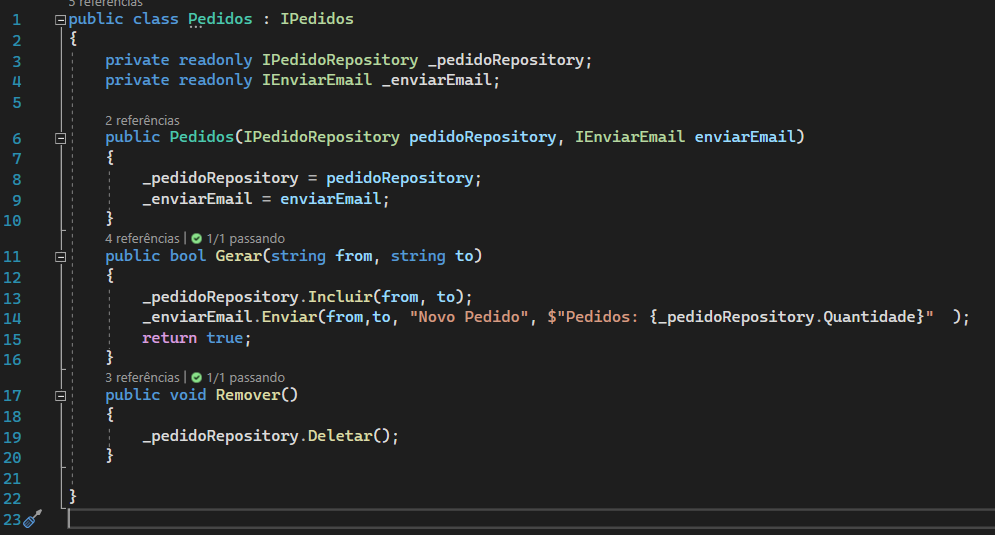

# SRP - Single Responsability Principle

Cada classe deve ter apenas uma responsabilidade a ser cumprida.

Vantagens:

- Única responsabilidade
- Classes menores
- Fácil de manter
- Fácil de entender
- Fácil de testar

## Original

Uma classe unica que contempla envio de email e geração de log.

`PedidoSRPOriginal pedido = new PedidoSRPOriginal();`

## Novo

A classe de pedido cuida apenas das tratativas do pedidos. Existe novas classe para cuidar de _registrar Logs_ e uma para _Envio de Email_ e _Manipulação dos Dados_.

Alterações:

- _RegistraLog_, agora é uma classe _static_ não precisando mais instancia-la;
- _EnviarEmail_, possui uma interface e cuida apenas do envio do e-mail;
- _PedidoRepository_, possui uma interface e cuida do acesso e manipulação dos dados;

`PedidoSRP pedido = new PedidoSRP();`

---

[Voltar](../readme.md)
