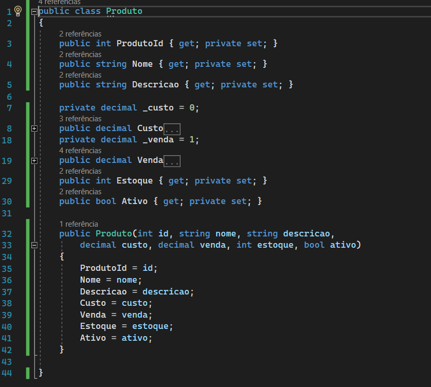
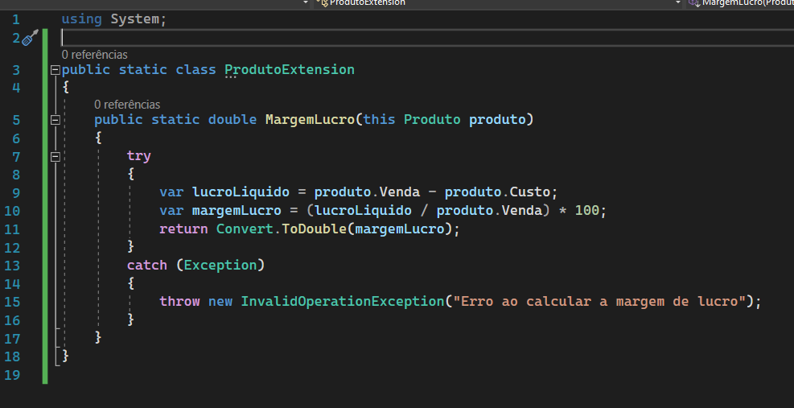

## Open/Close

Você deve ser caoaz de estender um comportamento de uma classe sem a necessidade de alterá-lo.

- Abertas para extensão
- Fechadas para alteração
- Incluir novas funcionalidades sem precisar mexer no que já está incrmentando mantendo o codigo estavel.

---

